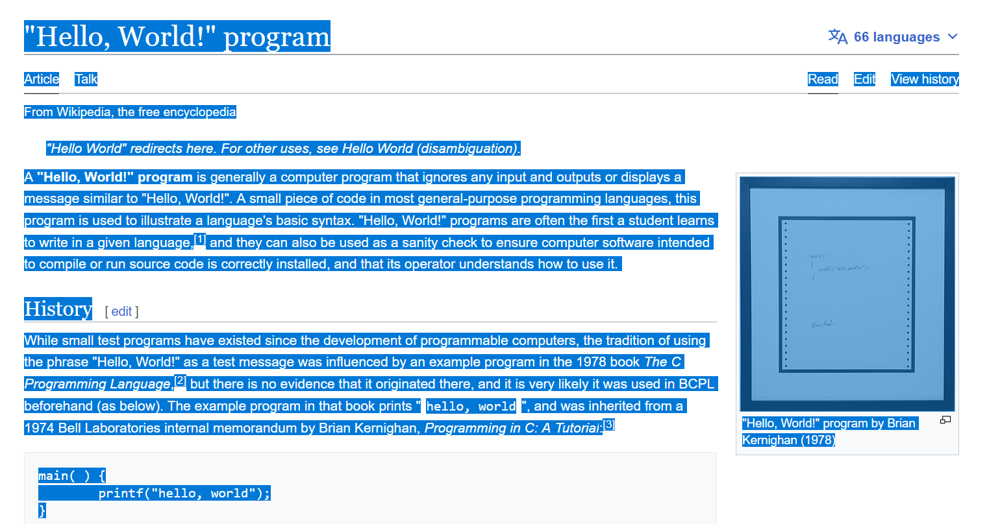

# Clipboard to Wordlist

**`qwl`** generates a wordlist from your clipboard text.

<br />

## How to Use

### 1. Copy text.

For example, copy text in website.



https://en.wikipedia.org/wiki/%22Hello,_World!%22_program

### 2. Run qwl to generate a wordlist

```sh
qwl > words.txt

# Specify the minimum/maximum word length
qwl --min 5 --max 8 > words.txt
```

You should see the wordlist generated from copied text.

<br />

## Installation

### Install with Go

```sh
go install github.com/hideckies/qwl@latest
```

### Clone This Repo & Build

```sh
git clone https://github.com/hideckies/qwl.git
cd qwl
go get ; go build
```
### Notes

```sh
- No clipboard utilities available. Please install "xsel", "xclip", "wl-clipboard" or Termux:"API add-on for termux-clipboard-get/set".
```
